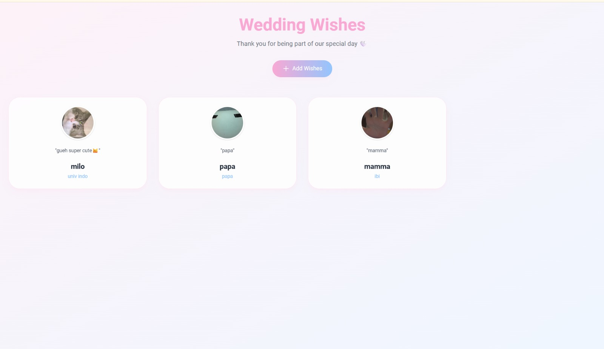

```markdown
# Guestbook App with CI/CD Pipeline

A modern, responsive Guestbook web application built using Laravel, Tw-Elements, and TailwindCSS. This project features a fully automated CI/CD pipeline integrated with code quality analysis and containerized deployment.



## 🚀 Tech Stack

*   **Frontend:** HTML, TailwindCSS, Tw-Elements
*   **Backend:** Laravel 11, PHP 8.2
*   **Database:** Supabase (PostgreSQL)
*   **Code Quality:** SonarQube & PHPUnit
*   **Deployment:** Docker, GitHub Container Registry (GHCR), Microsoft Azure App Service

## ✨ Features

*   **Guest Registration:** Visitors can leave their wishes, name, email, and company details.
*   **Real-time Display:** Wishes are instantly displayed on the homepage.
*   **Search Functionality:** Easily find specific guests or messages using the search bar.
*   **Fully Responsive:** Optimized for both desktop and mobile viewing.

## ⚙️ CI/CD Architecture

This project implements a strict, two-stage CI/CD pipeline using GitHub Actions to ensure code quality and seamless deployment:

```text
Push to master
      │
      ▼
┌─────────────────────────────────┐
│  CI: Testing & Quality          │
│  ├── Setup PHP 8.2 + PCOV       │
│  ├── Install Composer & NPM     │
│  ├── Build Frontend Assets      │
│  ├── Run PHPUnit Tests          │
│  │   └── Generate coverage.xml  │
│  └── SonarCloud Scan            │
└─────────────────┬───────────────┘
                  │ only if CI passed
                  ▼
┌─────────────────────────────────┐
│  CD: Build & Deploy             │
│  ├── Build Docker Image         │
│  ├── Push to GitHub Container   │
│  │   Registry (ghcr.io)         │
│  └── Deploy to Azure App Service│
└─────────────────────────────────┘

```

1. **Continuous Integration (CI):**
Runs automated tests using PHPUnit in an in-memory SQLite database and performs static code analysis using SonarQube to maintain code quality.
2. **Continuous Deployment (CD):**
Acts conditionally upon CI success. It builds a Docker image, pushes it to GHCR, and deploys the updated container to Microsoft Azure.

## 🛠️ Local Installation

1. Clone the repository:

```bash
   git clone [https://github.com/tiaraaulia1008/guestbookpso5.git](https://github.com/tiaraaulia1008/guestbookpso5.git)

```

2. Navigate to the directory and install dependencies:

```bash
   cd guestbookpso5
   composer install
   npm install && npm run build

```

3. Set up the environment variables:

```bash
   cp .env.example .env

```

*Note: Update the `.env` file with your local database or Supabase credentials.*

4. Generate the app key and run migrations:

```bash
   php artisan key:generate
   php artisan migrate

```

5. Start the local server:

```bash
   php artisan serve

```

## 📞 Contact

* **Developer:** Shahnaz Ariqah Simanullang
* **GitHub:** [github.com/shahnazariqahs](https://www.google.com/search?q=https://github.com/shahnazariqahs)

```

```
